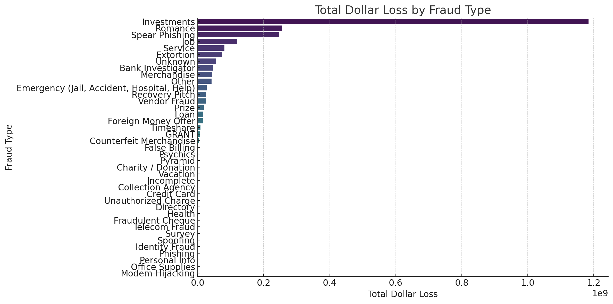
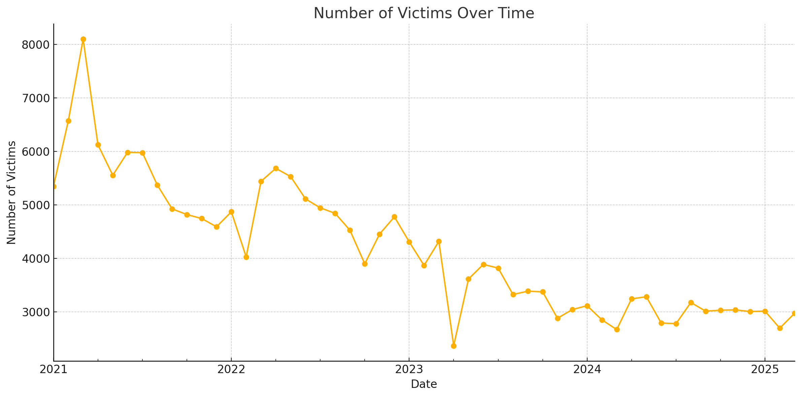
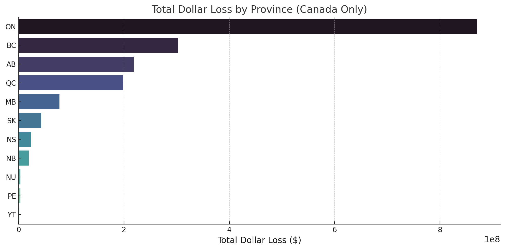
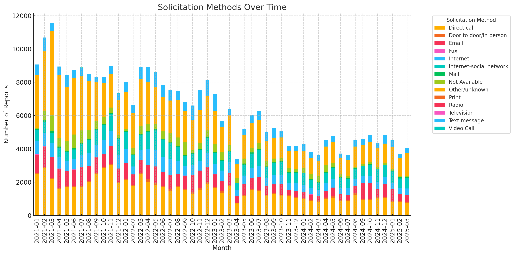

# 💼 Canadian Anti-Fraud Centre (CAFC) Data Analysis (2021–2025)

Welcome to this fraud analytics project, based on open data from the Canadian Anti-Fraud Centre (CAFC). This repository showcases the use of Python for structured data wrangling, exploratory data analysis, and insight generation on real-world fraud and cybercrime reports across Canada.

## 🏢 Project Background

This analysis simulates a scenario where I am a Data Analyst working for a national fraud intelligence unit under Canada’s Public Safety department. The CAFC collects, analyzes, and shares fraud and cybercrime reports from Canadian residents, aiding law enforcement and public awareness.

**Industry**: Public Safety / Cybersecurity  
**Active Years**: 2021–2025 (data timeframe)  
**Business Model**: Government-funded fraud surveillance and public reporting  
**Key Metrics**: Fraud Type, Dollar Loss, Number of Victims, Solicitation Method, Report Type, Geographic Distribution

## 🔍 Key Analysis Categories & Recommendations

Insights and recommendations are provided in the following key areas:

- **Fraud Types & Dollar Loss**
- **Victim Impact & Volume**
- **Geographic Distribution**
- **Reporting Behavior**

🔗 SQL cleaning queries: *N/A – CSV dataset cleaned using Pandas in Python*  
🔗 Targeted business questions: *See insights below*  
🔗 Dashboard (planned): [Insert Tableau Public link if available]

---

## 🧾 Data Structure & Initial Checks

The raw data was extracted from a structured CSV file from CAFC's Open Government portal. After cleaning, the following core variables were retained:

- `Fraud and Cybercrime Thematic Categories`
- `Solicitation Method`
- `Date Received`
- `Complaint Type`
- `Province/State`
- `Number of Victims`
- `Dollar Loss (CAD)`

📊 Total Rows: ~147,000  
📍 Geographical Scope: All Canadian provinces + unknown  
📅 Temporal Range: Jan 2021 – Mar 2025

---

## 📌 Executive Summary

### 🧠 Top 3 Insights:
1. **Romance and Investment Frauds account for the highest financial losses** despite relatively fewer cases.
2. **Phone remains the dominant solicitation method**, though online methods (email, web, social media) have steadily increased.
3. **Ontario and British Columbia report the highest fraud volumes**, but Alberta has the highest average loss per case.

---

## 🔎 Insights Deep Dive

### 📂 Category 1: Fraud Type & Financial Loss
- Romance and Investment Frauds dominate financial damage (>$6K median loss per case).
- High-volume categories like Phishing and Prize scams show low per-case losses.

---

### 👥 Category 2: Victim Impact
- Victim counts increased sharply in 2023.
- Individual-targeting frauds (e.g., Romance, Identity) show higher emotional + monetary impact.

---

### 🌍 Category 3: Geographic Trends
- Ontario, BC, and Alberta lead in both volume and total losses.
- Alberta shows higher **average** loss per complaint.

---

### 📞 Category 4: Solicitation Methods & Reporting Trends
- Phone dominates overall, but web/email rising sharply post-2022.
- Suggests increasing digital exposure and user trust in online reporting.

---

## ✅ Recommendations

To support CAFC’s operational and outreach goals:
1. **Run awareness campaigns** for high-loss frauds like Romance & Investment.
2. **Enhance tracking systems for phone scams** via telecom regulation.
3. **Prioritize outreach in under-reported provinces** with high avg losses.
4. **Improve online report forms** to reduce “Unknown” fraud types.

---

## ⚠️ Assumptions & Limitations

- Missing `Province` entries were excluded from spatial analysis.
- $0 losses retained for phishing/identity fraud (delayed impact).
- Fraud type categorization aligned with official CAFC annex definitions.

---

## 📁 Repository Contents

- `fraud_analysis.ipynb`: Full Jupyter notebook
- `cafc-open-dataset.csv`: Raw dataset
- `/visuals`: Graphical output folder
